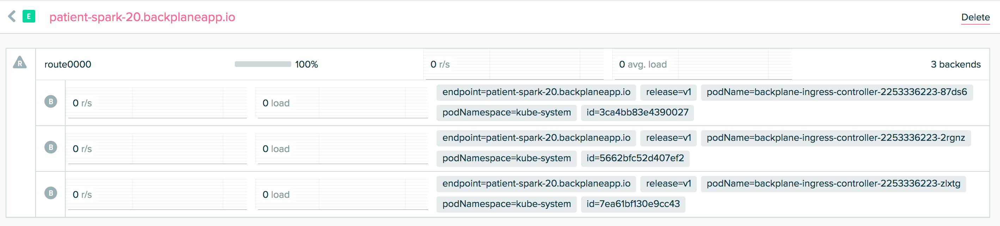

## Backplane.io Ingress Controller

Simple setup to get [Backplane.io](https://www.backplane.io/) hooked up as a Kubernetes Ingress Controller. This makes it possible to do things like have a publicly available load balancer from a behind-the-firewall install with say [Tectonic Bare-metal](https://coreos.com/tectonic) or [minikube](https://github.com/kubernetes/minikube).

## Setup Backplane Ingress Controller

Setup the Backplane secret:

```
export BACKPLANE_TOKEN=SECRETS_GO_HERE
kubectl create secret -n kube-system generic backplane-token --from-literal=bptoken=${BACKPLANE_TOKEN}
```

Configure any backplane labels, importantly the endpoint:

```
kubectl create configmap backplane-config -n kube-system --from-literal=labels=endpoint=patient-spark-20.backplaneapp.io,release=v1
```

Deploy backplane Ingress and a default 404 page

```
kubectl create -f https://raw.githubusercontent.com/philips/backplane-kubernetes-ingress/master/ingress-controller.yaml
kubectl create -f https://raw.githubusercontent.com/kubernetes/ingress/master/examples/deployment/nginx/default-backend.yaml
```

## Debugging Logs

NGINX:

```
kubectl get pods --namespace=kube-system -l k8s-app=backplane-ingress-controller -o jsonpath='{range .items[*]}{.metadata.name}{"\n"}{end}' | xargs -I {} kubectl -n kube-system -c nginx-ingress-controller logs {}
```

Backplane Agent:

```
kubectl get pods --namespace=kube-system -l k8s-app=backplane-ingress-controller -o jsonpath='{range .items[*]}{.metadata.name}{"\n"}{end}' | xargs -I {} kubectl -n kube-system -c bpagent logs {}
```

## Deploy an App w/ Ingress

```
kubectl run --image=quay.io/philips/host-info:latest host-info
kubectl expose deployment host-info --session-affinity=None --port 8080
kubectl create -f https://raw.githubusercontent.com/philips/host-info/master/ingress.yaml
```

## Scaling

Adding additional backends is as simple as scaling the deployment:

```
kubectl scale deployments backplane-ingress-controller -n kube-system --replicas=3
```



## Future Work

- Make a native Backplane Ingress controller instead of relying on nginx see https://github.com/kubernetes/ingress/tree/master/examples/custom-controller
